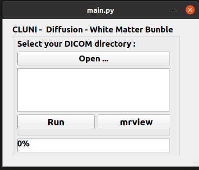

# mri_dwi_cluni

Pre-process MRI diffusion data using [MRTrix](https://mrtrix.readthedocs.io) software
and run [TractSeg](https://github.com/MIC-DKFZ/TractSeg) software to get white matter bundle.

Table of contents

1. [Disclaimer](#disclaimer)
2. [How it works](#how-it-works)
3. [How to use](#how-to-use)

<a name="disclaimer"></a>
## Disclaimer
This little application has been developed for a specific use and is not intended to be modular.
It will only work if there is only one diffusion image, one anatomical image (optional) and one pepolar image (optional).

<a name="how-it-works"></a>
## How it works

### Data conversion

You only need to give the DICOM directory path and the module will organize your data in BIDS (using [dcm2bids](https://unfmontreal.github.io/Dcm2Bids)). A [dcm2bids configuration file](https://unfmontreal.github.io/Dcm2Bids/3.1.1/how-to/create-config-file/) should be specified in the `BidsConfigFile` field in the [configuration file](./config/config.json).

/!\ For Philips data, as the phase encoding direction cannot be found in the DICOM, you need to add the information in the dcm2bids configuration file using [sidecar_changes field](https://unfmontreal.github.io/Dcm2Bids/3.1.1/how-to/create-config-file/#sidecar_changes-id-and-intendedfor) (see [dcm2bids configuration file template](./config/bids_dcm2bids_config_template.json))

The BIDS subject name is composed of the DICOM tag (0x10, 0x0010) (patient's name) and the DICOM tag (0x10, 0x0030) (patient's date of birth).
The tag (0x08, 0x0020) (study date) is used for the BIDS session name.

If you want anonymised data, you will need to anonymise your DICOM before to use this module.

This module need the following data :
- one DWI image (mandatory)
- one b0 with reverse phase encoding direction ([pepolar](https://bids-specification.readthedocs.io/en/latest/modality-specific-files/magnetic-resonance-imaging-data.html#case-4-multiple-phase-encoded-directions-pepolar) image) (optional)
- one anatomical image (T1w) (optional)

### Processing

For diffusion image, the following preprocessing are done:
- Denoising
- Unringing
- Motion distortion correction (Eddy correction and Topup correction if pepolar image)
- Bias field correction
- Creation of a brain mask

Then the fibers orientation distribution (FOD) is estimated and the peaks of the spherical harmonic function in each voxel are extracted.

The CSD peaks are provide to TractSeg to get white matter bundle.

If there is an anatomical image, the image in co-register to the diffusion image.

### Outputs

All the outputs are in the directory `/path/to/bids/directory/derivatives/sub-*/ses-*/`.

<a name="how-to-use"></a>
## How to use

### Clone this repository

```bash
git clone git@github.com:manuegrx/mri_dwi_cluni.git
```

### Install python requirements

```bash
pip install -e .
```

### Configure your `config/config.json`

Add the following path in the configuration file:
- OutputDirectory = path to BIDS directory, the processing will be added in OutputDirectory/derivatives/sub-*/ses-*/
- BidsConfigFile = path to dcm2bids config file
- WorkingDirectory = path to working directory (only used for temporary files)

```bash
{
    "OutputDirectory": "/path/to/bids/directory",
    "BidsConfigFile": "/path/to/bidsd_dcm2bids_config_template.json",
    "WorkingDirectory": "/path/to/working/directory"
}
````

### Launch the module

```bash
python ./mri_dwi_cluni/main.py
```



Click on "open" and choose your DICOM directory.

Click on "run.

## Requirements

[MRTrix](https://mrtrix.readthedocs.io) software should be install and it should be possible to run the MRTrix commands from the terminal. You can try in a terminal:

```bash
mrinfo
```

[TractSeg](https://github.com/MIC-DKFZ/TractSeg) should be install as required (so PyTorch should be install) and it should be possible to run the TractSeg commands from the terminal.

[ANTs](http://stnava.github.io/ANTs/) software should be install and it should be possible to run the ANTs commands from the terminal.

[dcm2niix](https://github.com/rordenlab/dcm2niix/releases) software should be install (release >=version 20-july-2022)

Others requirements (python libraries):
- argparse
- json
- pydicom
- unidecode
- dcm2bids>=3.1.1
- TractSeg
- MRTrix>=3.0.2
- pyQt5
